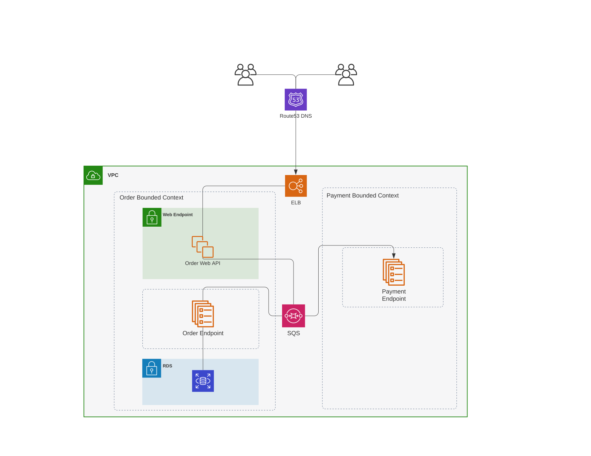
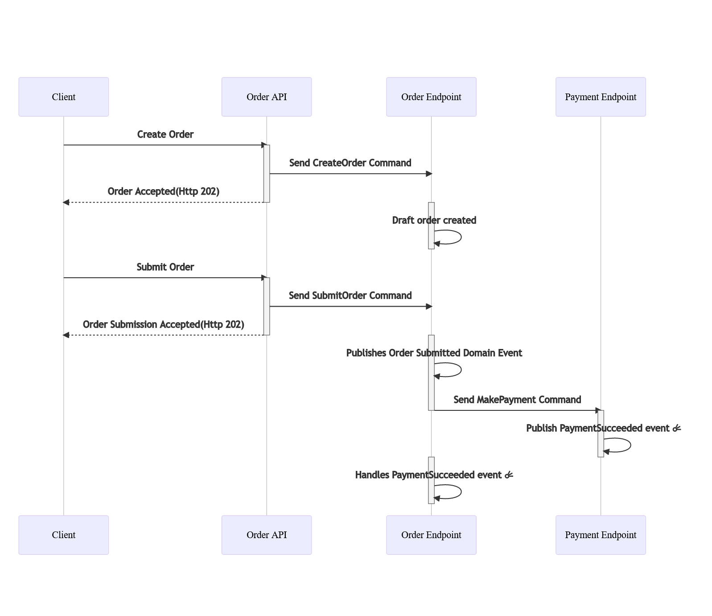
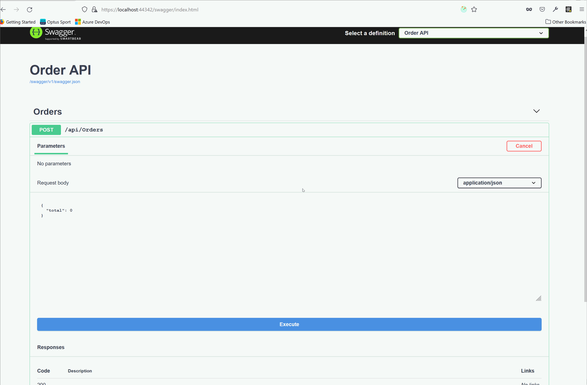

# Event Driven Sample
 
 This is a sample of event driven system using messages.

 There are three services involved in this sample.

 * `Demo.Order.Api` -> API endpoint to receive order
 * `Demo.Order.Endpoint` -> Worker endpoint that process the order requests
 * `Demo.Payment.Endpoint` -> Worker endpoint that process payment messages

 # How to run
  * Go to the root directior
  * Run `docker compose up`. This will run all the dependencies (RabbitMq, Postgres)
  * Run the solution (Ensure that all the `Demo.Order.Api`, `Demo.Order.Endpoint` and `Demo.Payment.Endpoint` are set as start up projects )
  * Ignore the licensing page opened by the application when it starts
  * Go to [Swagger](https://localhost:44342/)

# High level system diagram

# Flow

# Example
